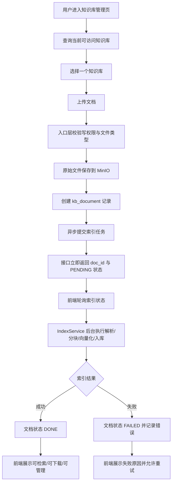

# 06-知识库管理接口——上传文档与索引状态

本文基于 [10-知识库管理接口——上传文档与索引状态.md](/D:/Code/python/Practical_Project/rag-kb/docs/references/10-知识库管理接口——上传文档与索引状态.md) 梳理本阶段的业务目标、核心流程与范围边界，作为后续 Spec 和代码实现的前置理解文档。

## 1. 任务背景

前一阶段已经完成了离线索引管道内部能力：文档解析、分块、Embedding、chunk 入库、失败重试与版本切换。这些能力目前停留在 Service 层，前端和外部调用方还无法直接使用。

本阶段要解决的问题是：把“原始文件上传 + 文档记录创建 + 异步索引提交 + 状态轮询”打通成一条完整业务链路，并补齐知识库管理侧最基本的接口能力，让知识库从“内部可索引”走向“外部可使用”。

为什么要单独做这一阶段：

- 原始文件不能直接存数据库，需要对象存储承接。
- 索引耗时较长，上传接口必须异步化，不能让用户长时间阻塞等待。
- 文档管理必须带权限边界，不能让任何登录用户直接读写任意知识库。
- 索引失败、重试中、重建中等状态需要可见，否则前端无法做管理与反馈。

本阶段的前置前提：

- `IndexService` 及其索引任务重试逻辑已经存在。
- `KbDocument`、`DocChunk`、`IndexTask` 等核心数据模型已具备。
- MinIO 已作为文件对象存储方案选定，但当前项目里仍缺少完整业务接入。

## 2. 业务流程

### 2.1 总体业务链路



### 2.2 业务生命周期拆解

#### 2.2.1 知识库可见性

用户进入管理页后，系统先根据“管理员身份、用户显式授权、部门授权、公开知识库”计算当前用户可访问的知识库列表。列表结果除了基础元数据，还要告诉前端“当前用户具备什么权限级别”，这样前端才能决定是否展示上传、删除、重建索引等按钮。

#### 2.2.2 文档上传

上传动作不是一次性完成“上传 + 索引 + 返回结果”，而是拆成两个阶段：

1. 入口层检查当前用户是否对目标知识库有写权限。
2. 检查文件类型是否在允许范围内。
3. 将原始文件保存到 MinIO。
4. 创建 `kb_document` 记录，保存文件名、类型、大小、MinIO 路径、上传人等信息。
5. 提交索引任务，立即返回 `doc_id` 和 `PENDING` 状态。

这里的关键业务选择是“先返回，再后台索引”。因为 PDF / Word 文档解析与向量化可能持续数秒到数十秒，同步等待会显著拉差接口体验。

#### 2.2.3 索引状态轮询

前端在拿到 `doc_id` 后，不直接等待上传接口完成，而是通过状态接口轮询：

- `PENDING`：任务已提交，尚未开始或正在等待重试。
- `PROCESSING`：后台正在执行索引。
- `DONE`：索引完成，可参与后续检索。
- `FAILED`：索引失败，前端需要展示错误原因。

状态接口除了文档状态，还应带出最近一次索引任务的重试次数、chunk 数量、token 数量、索引完成时间等信息，便于运营与排错。

#### 2.2.4 文档管理动作

除上传与查状态外，本阶段还需要支持一组紧邻上传链路的管理动作：

- 查询知识库下的文档列表。
- 下载原始文件。
- 删除文档。
- 手动触发重建索引。

这些动作的核心目的不是扩展查询能力，而是闭环“上传后怎么管理文档”的日常操作场景。

#### 2.2.5 删除与重建

删除文档时，业务上同时涉及三类数据：

- 文档主记录：保留软删除标记，方便审计和后续恢复设计。
- chunk 向量数据：直接硬删除，避免无效向量长期残留影响检索。
- MinIO 原文件：删除对象存储中的原始文件。

重建索引时，不重新创建一条全新文档，而是基于原有文档记录重新提交索引任务，并配合版本号机制保证旧版本 chunk 在新版本成功前仍可继续服务。

### 2.3 权限流转原则

权限校验放在接口入口层统一执行，而不是散落在各个内部服务中。这样可以避免“某个接口忘记调用权限方法”导致裸奔。

本阶段权限原则如下：

- 读权限：管理员、公开知识库用户、显式具备用户/部门授权的用户可访问。
- 写权限：仅管理员或显式具备 `WRITE / ADMIN` 权限的用户可上传、删除、重建索引。
- 文档状态、文档下载、文档列表都属于知识库读权限范围。

## 3. 业务边界（Scope）

### 3.1 In Scope（本次实现）

本阶段必须完成的业务能力：

- 补齐知识库管理首期接口，至少覆盖：
  - 查询当前用户可访问的知识库列表
  - 创建知识库
  - 上传文档
  - 查询文档索引状态
  - 查询知识库下的文档列表
  - 下载原始文件
  - 删除文档
  - 手动触发重建索引
- 补齐 MinIO 业务接入能力，用于原始文件上传、下载、删除。
- 建立“上传文件 -> 创建文档记录 -> 提交索引任务 -> 前端轮询状态”的完整闭环。
- 补齐知识库权限数据模型与基础权限校验逻辑，至少支持管理员、用户授权、部门授权、公开知识库这几种判断来源。
- 定义接口需要的请求/响应 DTO，避免直接把数据库实体原样暴露给前端。
- 与现有 `IndexService` 对接，让上传接口真正能驱动已完成的离线索引能力。

### 3.2 Out of Scope（暂不实现）

本阶段明确不做的内容：

- 不实现完整认证体系接入，例如 JWT、Session、中间件注入当前用户；当前阶段允许使用占位式 `UserContext` 或等价方案承接。
- 不实现前端页面、上传组件、轮询 UI、失败提示 UI，只提供后端接口能力。
- 不实现知识库成员管理、权限授予/回收接口；本阶段只消费已有权限数据并执行校验。
- 不实现查询链路、混合检索、Reranker、回答生成，这些属于在线问答链路。
- 不实现文档内容编辑、增量 diff 重建、文档版本对比等更复杂的文档演进能力。
- 不实现对象存储抽象切换、预签名 URL、分片上传、断点续传等增强型文件管理能力。
- 不解决生产级审计、操作日志大盘、通知回调等运维增强需求。

## 4. 本阶段与前序能力的衔接

本阶段不是重新设计索引管道，而是把前一阶段已经完成的离线能力包成“可调用的业务入口”。

衔接关系如下：

```plain
知识库管理接口
  -> 调用 MinIO 保存原文件
  -> 创建 kb_document
  -> 调用 IndexService.submit_index_task(doc_id)
  -> 由既有索引管道完成后台处理
  -> 状态接口读取 kb_document / kb_index_task 返回前端
```

因此，当前阶段的重点不是继续扩展 `IndexService` 内部算法，而是把上传、权限、文档记录与状态查询这几段业务链路接起来。

## 5. 下一步文档建议

完成本 Plan 后，下一份 Spec 需要重点回答这些技术问题：

- FastAPI 路由层如何组织这些接口，依赖注入怎么安排。
- `MinioStorageService` 的 Python 版本完整签名与异常处理策略是什么。
- DTO / Schema 如何与现有 SQLAlchemy 模型对齐。
- 权限检查放在哪一层，当前用户上下文如何临时承接。
- 上传接口与索引服务的调用边界、异常边界、事务边界如何划分。
