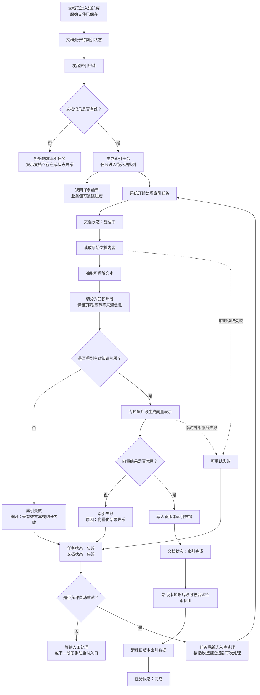

# 索引管道建立实现执行过程

## 执行范围

本次根据以下文件实现索引管道服务层：

```plain
docs/specs/10-索引管道建立spec.md
```

In scope：

- 新增 `IndexService`，作为离线索引管道的服务层入口。
- 新增文档、索引任务、chunk 三类 Repository。
- 新增当前阶段最小 `MinioStorageService` Protocol。
- 支持基于已有 `KbDocument` 创建 `IndexTask`。
- 支持后台投递本地 asyncio task。
- 支持下载原始文件、解析、分块、Embedding、组装 `DocChunk`、写入 chunk。
- 支持文档与索引任务状态流转。
- 支持重建索引时“先写新版本，再清理旧版本”。
- 支持手写任务级延迟重试调度。
- 新增索引服务测试覆盖主要验收场景。

Out of scope：

- 不实现 FastAPI 路由层。
- 不实现文档上传、索引状态查询、手动重试 HTTP 接口。
- 不实现完整 MinIO SDK 封装。
- 不重写已完成的 Embedding 服务。
- 不新增 `DocumentService`。
- 不实现在线查询、混合检索、RRF、Reranker、上下文裁剪或回答生成。
- 不引入 Celery / Dramatiq 等生产级外部任务队列。

## 新增和修改文件

新增文件：

```plain
app/services/indexing.py
app/integrations/minio.py
app/repositories/documents.py
app/repositories/index_tasks.py
app/repositories/chunks.py
tests/services/test_indexing.py
docs/process/07-索引管道建立实现执行过程.md
```

修改文件：

```plain
app/repositories/__init__.py
```

### 文件职责简述

| 文件 | 职责 |
| --- | --- |
| `app/services/indexing.py` | 索引管道核心编排服务，负责创建任务、投递后台执行、串联下载/解析/分块/向量化/入库、处理状态流转和任务级重试。 |
| `app/integrations/minio.py` | 当前阶段的 MinIO 最小接口定义，只声明 `download(object_key) -> bytes`，完整 SDK 封装留到下一阶段。 |
| `app/repositories/documents.py` | `kb_document` 数据访问层，负责查询文档、更新 `PROCESSING / DONE / FAILED` 状态和索引统计字段。 |
| `app/repositories/index_tasks.py` | `kb_index_task` 数据访问层，负责创建索引任务、更新任务状态、记录失败原因、维护重试次数。 |
| `app/repositories/chunks.py` | `kb_doc_chunk` 数据访问层，负责批量写入 chunk，并在新版本索引成功后清理旧版本 chunk。 |
| `app/repositories/__init__.py` | 导出本阶段新增的 Repository，方便后续依赖注入或服务组装时统一导入。 |
| `tests/services/test_indexing.py` | 索引服务测试，使用 fake repository / storage / loader / chunk / embedding 覆盖提交、成功、失败和重试路径。 |
| `docs/process/07-索引管道建立实现执行过程.md` | 本次实现过程说明，记录业务流程、代码执行流程、验证结果和 review 关注点。 |

## 业务主要流程

### 业务核心流程图



业务步骤：

1. 文档先由外部上传或脚本写入知识库，本阶段从“文档已存在”开始。
2. 业务侧发起索引申请，系统校验文档记录是否有效。
3. 校验通过后生成索引任务，并返回任务编号，便于后续追踪处理进度。
4. 系统把文档标记为处理中，开始从原始文件中抽取可索引内容。
5. 原始内容会被整理为知识片段，并保留页码、章节等引用来源信息。
6. 有效知识片段会被转成向量索引数据，写入新版本索引。
7. 新版本索引写入成功后，文档变为索引完成，后续查询链路即可检索这些知识片段。
8. 如果索引失败，系统记录失败原因；可自动恢复的失败进入延迟重试，不可自动恢复的失败等待人工处理。

核心逻辑走向：

```plain
文档已入库
  -> 发起索引申请
  -> 生成可追踪索引任务
  -> 抽取文本并形成知识片段
  -> 生成向量索引
  -> 索引成功：文档可被检索
  -> 索引失败：记录原因并决定重试或人工处理
```

### 正常索引链路

```plain
已有 kb_document
  -> IndexService.submit_index_task(doc_id)
  -> 查询文档是否存在
  -> 创建 kb_index_task(status=PENDING)
  -> 通过 _launch_task(...) 投递后台任务
  -> 返回 task_id

后台执行 run_task(task_id, doc_id)
  -> task = RUNNING
  -> document = PROCESSING
  -> MinioStorageService.download(document.minio_path)
  -> DocumentLoaderService.load(BytesIO(raw_file), document.file_name)
  -> ChunkService.split_documents(parsed_docs)
  -> EmbeddingService.embed_documents(texts)
  -> 组装 DocChunk
  -> 写入新版本 chunk
  -> document = DONE
  -> 清理旧版本 chunk
  -> task = DONE
```

### 失败链路

```plain
任意阶段失败
  -> run_task(...) 捕获异常
  -> task = FAILED
  -> document = FAILED
  -> 记录 error_msg
  -> 如果是 RetryableIndexError 且 retry_count < max_retry
       -> retry_count + 1
       -> task.status = PENDING
       -> _schedule_retry(...)
     否则
       -> 保持 FAILED
```

### 延迟重试链路

```plain
RetryableIndexError
  -> _retry_if_possible(...)
  -> task.retry_count + 1
  -> delay_seconds = 2 ** (retry_count - 1)
  -> asyncio.create_task(_delayed_retry(...))
  -> _delayed_retry 内部 await asyncio.sleep(delay_seconds)
  -> 到期后 _launch_task(task_id, doc_id)
```

说明：

- 任务级重试没有使用 Tenacity。
- 原因是任务级重试需要落库维护 `task.status`、`retry_count`、`error_msg` 和 `document.status`，并重新调度业务任务。
- Tenacity 仍适合 Embedding / Reranker 这类单次 API 调用级重试。

## 代码执行流程

### submit_index_task

位置：

```plain
app/services/indexing.py
```

执行过程：

```plain
submit_index_task(doc_id)
  -> document_repository.get(doc_id)
  -> 不存在则抛 NonRetryableIndexError
  -> task_repository.create(doc_id, task_type=INDEX)
  -> _launch_task(task.id, doc_id)
  -> return task.id
```

设计点：

- `submit_index_task(...)` 只负责创建任务和投递任务。
- 不在提交接口中执行解析、分块、向量化或写库。
- 这样后续接入路由层时，可以快速返回 `task_id`。

### run_task

执行过程：

```plain
run_task(task_id, doc_id)
  -> try _run_task_once(task_id, doc_id)
  -> RetryableIndexError:
       _mark_failed(...)
       _retry_if_possible(...)
  -> NonRetryableIndexError:
       _mark_failed(...)
  -> 其他异常:
       _mark_failed(...)
       _retry_if_possible(...)
```

设计点：

- `run_task(...)` 是真正的索引执行入口。
- 失败状态统一在这里收口，避免各个子步骤散落更新任务状态。
- 当前实现对文档存在后的索引阶段未知异常执行任务级重试，以对齐参考文献的 `doIndex(...) catch -> retryIfPossible(...)`。

### _run_task_once

执行过程：

```plain
_run_task_once(task_id, doc_id)
  -> 查询 IndexTask
  -> 查询 KbDocument
  -> task_repository.mark_running(task_id)
  -> document_repository.mark_processing(doc_id)
  -> commit_after_status_change()
  -> storage_service.download(document.minio_path)
  -> 记录“文档加载阶段开始了...”
  -> loader_service.load(...)
  -> 记录“文档加载阶段结束了...”
  -> 记录“文档分块阶段开始了...”
  -> chunk_service.split_documents(...)
  -> 记录“文档分块阶段结束了...”
  -> chunks 为空则 RetryableIndexError
  -> 记录“Embedding阶段开始了...”
  -> embedding_service.embed_documents(texts)
  -> 记录“Embedding阶段结束了...”
  -> vectors 数量与 chunks 数量不一致则 RetryableIndexError
  -> 根据 task.task_type 计算本次 doc_version
  -> _build_doc_chunks(...)
  -> chunk_repository.insert_many(doc_chunks)
  -> document_repository.mark_done(...)
  -> chunk_repository.delete_older_versions(doc_id, new_version)
  -> task_repository.mark_done(task_id)
```

设计点：

- 首次索引 `INDEX` 使用当前 `document.version`，保持数据库默认初始版本 `1`。
- 重建索引 `REINDEX` 使用 `document.version + 1`，通过新旧版本隔离避免半成品 chunk 被查询到。已发布 `DONE` 文档在重建期间不再改成 `PROCESSING`，因此查询层仍能使用旧版本 chunk。
- 首次索引仍会写入 `document(PROCESSING)`；已发布文档的 REINDEX 只写入 `task(RUNNING)`。状态变更后需要立即提交后台会话，确保外部轮询能看到任务执行态。
- 文档加载、文档分块、Embedding 三个阶段只打印固定开始/结束短日志，避免业务日志被外部请求明细淹没。
- 先写入新版本 chunk，再更新文档版本与状态，最后清理旧版本 chunk。
- 分块为空、向量数量错位都不会写入 chunk，但会按任务级重试策略消耗重试次数。

### _build_doc_chunks

输入：

```plain
document: KbDocument
chunks: list[Document]
vectors: list[list[float]]
doc_version: int
```

输出：

```plain
list[DocChunk]
```

字段映射：

```plain
DocChunk.doc_id        <- KbDocument.id
DocChunk.kb_id         <- KbDocument.kb_id
DocChunk.chunk_index   <- 当前 chunk 顺序
DocChunk.content       <- chunk.page_content
DocChunk.embedding     <- 对应位置 vector
DocChunk.page_num      <- chunk.metadata["page_num"]
DocChunk.section_title <- chunk.metadata["section_title"]
DocChunk.token_count   <- chunk.metadata["estimated_tokens"]
DocChunk.doc_version   <- new_version
```

约束：

- 第 `i` 个 chunk 必须对应第 `i` 个 vector。
- 不生成零向量。
- 不写入部分成功数据。

## 核心代码片段与讲解

### 任务提交只创建任务和投递执行

```python
async def submit_index_task(self, doc_id: int) -> int:
    document = await self.document_repository.get(doc_id)
    if document is None:
        raise NonRetryableIndexError(f"document not found: {doc_id}")

    task = await self.task_repository.create(doc_id, task_type=IndexTaskType.INDEX)
    await self._commit_before_launch()
    self._launch_task(task.id, doc_id)
    return task.id
```

讲解：

- 这里先查 `KbDocument`，保证索引任务一定基于已有文档记录创建。
- 文档不存在属于不可重试错误，因为延迟重试也无法凭空恢复文档记录。
- 创建任务后先执行可选的 `commit_before_launch` 钩子，再调用 `_launch_task(...)` 投递后台执行，并返回 `task.id`。
- 在 API 请求链路中，这个提交钩子用于确保新建文档和索引任务已经对后台独立会话可见。
- 该入口不做解析、分块、Embedding 或写库，保持“提交任务”和“执行任务”分离。
- `reindex_document(...)` 使用同样结构，只是创建任务时传入 `IndexTaskType.REINDEX`。

### 后台投递保存 Task 引用并隔离数据库会话

```python
def _launch_task(self, task_id: int, doc_id: int) -> None:
    task = asyncio.create_task(self._run_launched_task(task_id, doc_id))
    self._background_tasks.add(task)
    task.add_done_callback(self._handle_background_task_done)

async def _run_launched_task(self, task_id: int, doc_id: int) -> None:
    async with self.background_service_factory() as service:
        await service.run_task(task_id, doc_id)
```

讲解：

- `asyncio.create_task(...)` 把 `_run_launched_task(...)` 包装成事件循环中的后台协程任务。
- `_background_tasks` 保存 task 引用，避免后台任务只被事件循环弱引用管理。
- `add_done_callback(...)` 在任务完成后自动移除引用，避免集合无限增长。
- `_handle_background_task_done(...)` 会读取任务异常并记录日志，避免出现 `Task exception was never retrieved`。
- `_run_launched_task(...)` 通过 `background_service_factory` 创建独立索引服务，后台任务不复用请求级 `AsyncSession`。
- 这里替代了原 Spring 版本中 `IndexTaskLauncher + @Async` 的职责；Python 没有 Spring AOP 自调用失效问题，所以不单独抽 Launcher。

### run_task 统一收口失败状态

```python
async def run_task(self, task_id: int, doc_id: int) -> None:
    try:
        await self._run_task_once(task_id, doc_id)
    except RetryableIndexError as exc:
        await self._mark_failed(task_id, doc_id, str(exc))
        await self._retry_if_possible(task_id, doc_id, str(exc))
    except NonRetryableIndexError as exc:
        await self._mark_failed(task_id, doc_id, str(exc))
    except Exception as exc:
        await self._mark_failed(task_id, doc_id, str(exc))
        await self._retry_if_possible(task_id, doc_id, str(exc))
```

讲解：

- `_run_task_once(...)` 只表达成功路径，失败路径统一由 `run_task(...)` 处理。
- `RetryableIndexError` 会先落库为失败，再判断是否还能重试。
- `NonRetryableIndexError` 只标记失败，不进入自动重试。
- 未分类异常发生在索引执行阶段时，也会先记录失败再尝试任务级重试，贴近参考文献的宽重试策略。

### 真正的索引执行主流程

```python
try:
    raw_file = await self.storage_service.download(document.minio_path)
except IndexPipelineError:
    raise
except Exception as exc:
    raise RetryableIndexError(f"storage download failed: {exc}") from exc

parsed_docs = self.loader_service.load(BytesIO(raw_file), document.file_name)
chunks = self.chunk_service.split_documents(parsed_docs)
if not chunks:
    raise RetryableIndexError("no valid chunks generated from document")

texts = [chunk.page_content for chunk in chunks]
try:
    vectors = await self.embedding_service.embed_documents(texts)
except IndexPipelineError:
    raise
except Exception as exc:
    raise RetryableIndexError(f"embedding failed: {exc}") from exc

if len(vectors) != len(chunks):
    raise RetryableIndexError(
        f"embedding result count mismatch: expected {len(chunks)}, got {len(vectors)}"
    )

new_version = self._resolve_doc_version(task.task_type, document.version)
doc_chunks = self._build_doc_chunks(document, chunks, vectors, new_version)
token_count = sum(chunk.token_count for chunk in doc_chunks)

await self.chunk_repository.insert_many(doc_chunks)
await self.document_repository.mark_done(
    doc_id,
    chunk_count=len(doc_chunks),
    token_count=token_count,
    version=new_version,
)
await self.chunk_repository.delete_older_versions(doc_id, new_version)
await self.task_repository.mark_done(task_id)
```

讲解：

- `download -> load -> split -> embed -> insert` 对应离线索引主链路。
- 分块为空会失败且不写入 chunk，但按参考文献策略进入任务级重试。
- 向量数量必须与 chunk 数量一致，否则无法保证第 `i` 个向量对应第 `i` 个 chunk；该异常同样进入任务级重试。
- `_resolve_doc_version(...)` 根据任务类型计算版本：`INDEX` 保持当前版本，`REINDEX` 递增版本。
- 先写新版本 chunk，再更新文档版本和状态，最后清理旧版本 chunk，避免重建失败时旧版本数据提前丢失。

### 手写任务级延迟重试

```python
async def _retry_if_possible(self, task_id: int, doc_id: int, error_msg: str) -> None:
    task = await self.task_repository.get(task_id)
    if task is None or not task.can_retry():
        return

    retry_count = task.retry_count + 1
    await self.task_repository.mark_retry_pending(
        task_id,
        retry_count=retry_count,
        error_msg=error_msg,
    )
    self._schedule_retry(task_id, doc_id, retry_count)


def _schedule_retry(self, task_id: int, doc_id: int, retry_count: int) -> None:
    delay_seconds = 2 ** (retry_count - 1)
    task = asyncio.create_task(self._delayed_retry(task_id, doc_id, delay_seconds))
    self._background_tasks.add(task)
    task.add_done_callback(self._background_tasks.discard)


async def _delayed_retry(self, task_id: int, doc_id: int, delay_seconds: int) -> None:
    await asyncio.sleep(delay_seconds)
    self._launch_task(task_id, doc_id)
```

讲解：

- `retry_count` 先落库，再调度下一次执行，便于查询任务状态和排查失败原因。
- `delay_seconds = 2 ** (retry_count - 1)` 对应 1 秒、2 秒、4 秒的指数退避。
- `asyncio.sleep(...)` 只挂起当前重试协程，不阻塞事件循环线程。
- 这里没有使用 Tenacity，因为这是“持久化业务任务重新调度”，不是单次函数调用的原地 retry。

### DocChunk 字段组装

```python
metadata = chunk.metadata
page_num = metadata.get("page_num")
estimated_tokens = metadata.get("estimated_tokens")
section_title = metadata.get("section_title")

DocChunk(
    doc_id=document.id,
    kb_id=document.kb_id,
    chunk_index=index,
    content=chunk.page_content,
    embedding=vector,
    page_num=int(page_num) if page_num is not None else None,
    section_title=str(section_title) if section_title is not None else None,
    token_count=int(estimated_tokens) if estimated_tokens is not None else 0,
    doc_version=doc_version,
)
```

讲解：

- `doc_id`、`kb_id` 来自文档记录，保证 chunk 后续能按知识库和文档追溯。
- `chunk_index` 使用当前列表顺序，确保分块顺序稳定。
- `content` 来自 LangChain `Document.page_content`。
- `embedding` 来自相同下标的向量结果。
- ORM 模型中的 `embedding` 字段必须使用 `pgvector.sqlalchemy.Vector`，不能只用手写 `UserDefinedType` 生成 DDL；否则 asyncpg 写入时会收到 Python list 并报 `expected str, got list`。
- `page_num`、`section_title`、`estimated_tokens` 来自分块阶段标准化后的 metadata。
- `doc_version` 用于后续检索时只召回当前版本 chunk。

## PGVector 写入类型修订

重建索引联调时，Embedding 已成功返回 1024 维向量，但 chunk 写入阶段失败：

```plain
invalid input for query argument ... expected str, got list
```

根因：

- `kb_doc_chunk.embedding` 数据库字段是 `VECTOR(1024)`。
- 原 ORM 模型使用手写 `PGVector(UserDefinedType)`，只提供 `get_col_spec()` 生成 DDL。
- 该类型没有 SQLAlchemy bind processor，写入时 asyncpg 直接收到 Python `list[float]`，无法转换为 PostgreSQL vector 参数。

修订方式：

```python
from pgvector.sqlalchemy import Vector as PGVector

embedding: Mapped[list[float]] = mapped_column(PGVector(1024), nullable=False)
```

测试补充：

- `tests/test_database_models.py` 增加断言：`embedding` 字段仍编译为 `VECTOR(1024)`。
- 同时断言 `embedding` 类型存在 `bind_processor`，确保 Python 向量写入前会经过 PGVector 类型转换。

## 首次索引版本修订

后续联调发现首次上传文档后 `kb_document.version` 会从初始值 `1` 变为 `2`。原因是索引执行阶段没有区分任务类型，统一使用 `document.version + 1` 作为本次写入版本。

修订后的语义：

```plain
INDEX   -> 使用当前 document.version，首次上传索引后仍为 1
REINDEX -> 使用 document.version + 1，重建索引后递增版本
```

本次同步调整：

- `IndexService._resolve_doc_version(...)` 根据 `IndexTask.task_type` 计算本次 chunk 写入版本。
- 首次索引测试改为断言 `document.version == 1`、`chunk.doc_version == 1`。
- 新增重建索引测试，断言 `REINDEX` 后版本从 `1` 递增到 `2`。

## Repository 职责

### DocumentRepository

位置：

```plain
app/repositories/documents.py
```

职责：

- `get(doc_id)`：根据 ID 查询 `KbDocument`。
- `mark_processing(doc_id)`：文档进入 `PROCESSING`。
- `mark_done(...)`：文档进入 `DONE`，更新 `chunk_count`、`token_count`、`version`、`indexed_at`。
- `mark_failed(doc_id, error_msg)`：文档进入 `FAILED`，记录失败原因。

事务边界：

- Repository 只执行 `flush()`。
- 不在 Repository 内部 `commit()`。
- 事务提交仍交给外层数据库会话管理。

### IndexTaskRepository

位置：

```plain
app/repositories/index_tasks.py
```

职责：

- `create(...)`：创建 `IndexTask(status=PENDING)`。
- `mark_running(...)`：任务进入 `RUNNING`，记录 `started_at`。
- `mark_done(...)`：任务进入 `DONE`，记录 `finished_at`。
- `mark_failed(...)`：任务进入 `FAILED`，记录 `error_msg` 和 `finished_at`。
- `mark_retry_pending(...)`：任务改回 `PENDING`，更新 `retry_count` 和 `error_msg`。

### ChunkRepository

位置：

```plain
app/repositories/chunks.py
```

职责：

- `insert_many(chunks)`：批量新增 `DocChunk`。
- `delete_older_versions(doc_id, current_version)`：清理旧版本 chunk。

## MinIO 最小接口

位置：

```plain
app/integrations/minio.py
```

当前只定义 Protocol：

```python
class MinioStorageService(Protocol):
    async def download(self, object_key: str) -> bytes:
        ...
```

说明：

- 当前阶段不实现完整 MinIO 客户端。
- `IndexService` 只依赖 `download(...)`。
- 测试中使用 fake storage 返回 bytes 或抛出异常。

## TDD 过程

先新增测试文件：

```plain
tests/services/test_indexing.py
```

首次运行：

```powershell
$env:PYTHONPATH='.'; uv run pytest tests/services/test_indexing.py -v
```

结果：

```plain
ModuleNotFoundError: No module named 'app.services.indexing'
```

失败原因符合预期：索引服务模块尚未实现。

随后实现最小生产代码，再运行新增测试：

```powershell
$env:PYTHONPATH='.'; uv run pytest tests/services/test_indexing.py -v
```

结果：

```plain
10 passed
```

新增测试覆盖：

- `submit_index_task(doc_id)` 创建 `PENDING` 任务并投递后台执行。
- 文档不存在时抛出 `NonRetryableIndexError`，不创建任务。
- 成功索引时写入 chunk，文档和任务进入 `DONE`。
- 分块为空时失败，不写入 chunk，并进入任务级重试。
- 解析失败、Embedding 失败、Embedding 返回数量不一致、chunk 写入失败都会进入任务级重试。
- 可重试失败时 `retry_count + 1`，任务改回 `PENDING` 并调度重试。
- 重试次数耗尽后任务保持 `FAILED`。

## 验证记录

索引服务测试：

```powershell
$env:PYTHONPATH='.'; uv run pytest tests/services/test_indexing.py -v
```

结果：

```plain
10 passed
```

全量测试：

```powershell
$env:PYTHONPATH='.'; uv run pytest -v
```

结果：

```plain
44 passed, 1 warning
```

warning 为 FastAPI / Starlette TestClient 对当前 `httpx` 适配的弃用提示，不是本次索引管道实现引入的失败。

静态检查：

```powershell
$env:PYTHONPATH='.'; uv run ruff check app tests
```

结果：

```plain
All checks passed!
```

索引服务类型检查：

```powershell
$env:PYTHONPATH='.'; uv run mypy app/services/indexing.py
```

结果：

```plain
Success: no issues found in 1 source file
```

全量 mypy：

```powershell
$env:PYTHONPATH='.'; uv run mypy app
```

结果：

```plain
Found 11 errors in 5 files
```

主要为项目既有类型问题：

- `app/core/config.py`：`Settings()` 必填配置在 mypy 视角缺少命名参数。
- `app/core/security.py`：`jose`、`passlib` 缺少类型 stub。
- `app/services/document_loader/markdown_parser.py`：正则匹配结果可能为 `None`。
- `app/core/clients.py`：LangChain `ChatOpenAI` / `OpenAIEmbeddings` 参数类型与当前 stubs 不一致。

本次新增索引相关文件已单独通过 mypy。

## Review 关注点

- 当前没有实现路由层；后续 API 只需要调用 `IndexService.submit_index_task(...)`。
- 当前没有完整 MinIO 实现；下一阶段补 `download(...)` 的真实 SDK 封装即可。
- 当前没有独立 `IndexTaskLauncher`；Python 版本由 `IndexService._launch_task(...)` 使用 `asyncio.create_task(...)` 投递 `_run_launched_task(...)`，后台执行时通过工厂创建独立服务。
- 当前本地 asyncio task 在进程重启后不会恢复；生产可靠任务恢复应迁移到 Celery / Dramatiq 等外部队列。
- 当前任务级重试已对齐参考文献：文档存在后的下载、解析、分块、Embedding、入库和状态更新等索引阶段异常默认进入任务级重试；文档不存在仍不重试。
- 当前 Repository 只 `flush()` 不 `commit()`；请求级服务可通过 `commit_before_launch` 在启动后台任务前提交当前事务，后台任务再使用独立 session 管理自身提交/回滚。
- 当前 `IndexService` 不处理权限校验；权限隔离属于后续上传 / 查询链路。
- 当前 `EmbeddingService` 内部已处理 API 调用级缓存、批处理与 Tenacity 重试；索引层不重复实现。

## 后台会话修订

后续接入知识库管理接口后，重建索引接口暴露出一个后台会话问题：请求级 `IndexService` 创建任务后立即把同一个服务实例投递到后台，后台任务继续使用请求依赖注入的 `AsyncSession`，会在请求收尾提交事务时触发 SQLAlchemy `prepared` 状态冲突。

修订后：

- `submit_index_task(...)` / `reindex_document(...)` 支持 `commit_before_launch` 钩子，启动后台任务前先提交当前事务。
- `_launch_task(...)` 不再直接执行 `self.run_task(...)`，而是执行 `_run_launched_task(...)`。
- `_run_launched_task(...)` 通过 `background_service_factory` 创建独立索引服务，后台任务不复用请求级 `AsyncSession`。
- `_handle_background_task_done(...)` 会读取并记录后台任务异常，避免异常无人读取。

## 执行态状态可见性修订

联调上传文档后发现，在文档加载阶段查询数据库时，`kb_document.status` 和 `kb_index_task.status` 仍分别停留在 `PENDING`。代码虽然已经在 `_run_task_once(...)` 开始时调用 `mark_processing(...)` 和 `mark_running(...)`，但 Repository 只执行 `flush()`，后台独立 session 原先要等整个索引任务结束后才统一 `commit()`，导致外部轮询连接无法看到执行态。

修订后：

- `IndexService` 新增 `commit_after_status_change` 钩子。
- `_run_task_once(...)` 写入 `task(RUNNING)`、`document(PROCESSING)` 后立即调用该钩子。
- FastAPI 后台索引服务使用 `background_session.commit` 作为该钩子，使状态在下载、加载、分块和 Embedding 阶段就对外可见。

追加验证：

```powershell
$env:PYTHONPATH='.'; uv run pytest tests/services/test_indexing.py::test_run_task_commits_running_and_processing_status_before_loading -v
```

结果：

```plain
1 passed
```

追加验证：

```powershell
$env:PYTHONPATH='.'; uv run pytest tests/services/test_indexing.py -v
$env:PYTHONPATH='.'; uv run mypy app/services/indexing.py
```

结果：

```plain
15 passed
Success: no issues found in 1 source file
```

## 索引阶段短日志修订

重建索引联调时发现，MinerU / httpx 请求明细会输出大量完整 URL，导致真正关心的索引阶段进度不明显。修订后索引编排层只在关键阶段打印固定短日志：

```plain
文档加载阶段开始了...
文档加载阶段结束了...
文档分块阶段开始了...
文档分块阶段结束了...
Embedding阶段开始了...
Embedding阶段结束了...
```

这些日志不拼接文件内容、请求 URL、耗时和数量，避免为日志本身引入过多代码。

追加验证：

```powershell
$env:PYTHONPATH='.'; uv run pytest tests/services/test_indexing.py -v
$env:PYTHONPATH='.'; uv run pytest -v
uv run ruff check app tests
$env:PYTHONPATH='.'; uv run mypy app/services/indexing.py app/services/document_loader/mineru_client.py app/core/logging.py
```

结果：

```plain
tests/services/test_indexing.py: 15 passed
全量测试: 71 passed, 1 warning
ruff: All checks passed!
mypy: Success: no issues found in 3 source files
```

## 解析与分块线程池修订

文档替换接口提交重建索引任务后，联调发现同一 Uvicorn worker 上的查询请求可能要等索引任务完成才返回。根因不是查询接口显式等待索引完成，而是后台索引任务仍运行在同一个事件循环中；其中 `DocumentLoaderService.load(...)`、MinerU SDK 的 `loader.load()` 以及 `ChunkService.split_documents(...)` 都是同步函数，长耗时解析或分块会阻塞事件循环调度。

需要区分另一个查询现象：线程池修订只解决事件循环被同步解析/分块阻塞的问题。后续发布状态修订已经把已发布文档的 REINDEX 进度放入 `kb_index_task`，不再把主文档改成 `PENDING / PROCESSING`，因此替换或强制重建期间旧 chunk 可以继续被 RAG 检索召回。

修订后：

- MinIO 同步 SDK 继续通过 `asyncio.to_thread(...)` 包装。
- Embedding 继续使用异步 `aembed_documents(...)`。
- `IndexService._run_task_once(...)` 将文档加载阶段放入线程池：

```python
parsed_docs = await asyncio.to_thread(
    self.loader_service.load,
    BytesIO(raw_file),
    document.file_name,
)
```

- `IndexService._run_task_once(...)` 将文档分块阶段放入线程池：

```python
chunks = await asyncio.to_thread(self.chunk_service.split_documents, parsed_docs)
```

这样后台索引任务遇到同步解析和分块时会让出事件循环，避免同一 worker 上的查询请求被同步任务长时间卡住。本次不引入 Celery/RQ/独立进程队列，仍保持当前 `asyncio.create_task(...)` 的任务投递方式。

追加验证：

```powershell
uv run pytest tests/services/test_indexing.py::test_run_task_offloads_parse_and_chunk_steps_from_event_loop_thread -v
uv run pytest tests/services/test_indexing.py -v
```

结果：

```plain
单测: 1 passed
索引服务测试: 16 passed
```
